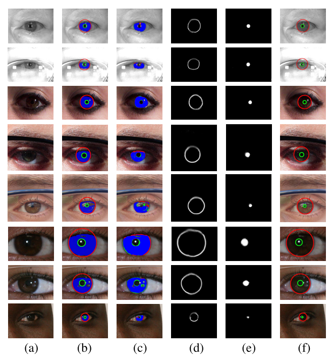

# Towards Complete and Accurate Iris Segmentation Using Deep Multi-Task Attention Network for Non-Cooperative Iris Recognition

Created by [Caiyong Wang](https://caiyong.wang/) @ Institute of Automation, Chinese Academy of Sciences (**CASIA**)

We propose a high-efficiency deep learning based iris segmentation approach, named **IrisParseNet**. 
The proposed approach first applies a multi-task attention network to simultaneously predict the iris mask, 
pupil mask and iris outer boundary. Then, based on the predicted pupil mask and iris outer boundary, 
parameterized inner and outer iris boundaries are achieved by a simple yet effective post-processing method. 
Overall, the proposed approach is a complete iris segmentation solution, i.e., iris mask and parameterized 
inner and outer iris boundaries are jointly achieved, which facilitates the subsequent iris normalization as well as iris feature extraction and matching. Hence the proposed approach can be used for iris recognition as a general drop-in replacement. To help reproduce our method, we have 
made the **models, manual annotations and evaluation protocol codes** freely available to the community. 



In the above figure, (a) original iris images from CASIA.v4-distance (top two), MICHE-I (middle three), and UBIRIS.v2 (bottom three) iris databases, 
(b) ground truth iris mask (blue), and inner (green) and outer (red) boundaries of the iris, (c) segmentation results of IrisParseNet (false positive error pixel (green), false negative error
pixel (red), and true positive pixel (blue)), (d) iris outer boundary predicted
by IrisParseNet, (e) pupil mask predicted by IrisParseNet, and (f) localization
results of IrisParseNet after post-processing (inner boundary (green) and outer boundary (red)) are shown from left to right.

## Citation
If you use this model or corresponding codes for your research, please cite our papers.

```
@article{wang2020iris,
  title={Towards Complete and Accurate Iris Segmentation Using Deep Multi-Task Attention Network for Non-Cooperative Iris Recognition}, 
  author={Wang, Caiyong and Muhammad, Jawad and Wang, Yunlong and He, Zhaofeng and Sun, Zhenan},
  journal={IEEE Transactions on Information Forensics and Security}, 
  year={2020},
  volume={15},
  pages={2944-2959},
  publisher={IEEE}
}
```

## Prerequisites
- linux
- Python 2.7 ( python3 is not supported!)
- CPU or NVIDIA GPU + CUDA CuDNN
- [Caffe](http://caffe.berkeleyvision.org/)  
- matlab R2016a 
- [Halcon](https://www.mvtec.com/products/halcon/) 10.0/13.0 or above 

## Getting Started

### Installing Caffe
We have provided the complete Caffe codes. Just install it following the official guide. You can also refer to [our another extended Caffe Version](https://github.com/xiamenwcy/extended-caffe).

- Caffe [[Google Drive]](https://drive.google.com/file/d/181EsUA6p12eoc7GU-zwSG5M4TxIR_pZZ/view) [[Baidu Drive]](https://pan.baidu.com/s/1zttJGXQfH2h3rLc37gQkXA)(zuhv)

### Model training and testing

The complete codes for training and testing the model are placed at **Codes/IrisParseNet**, and the post-processing executable program is placed at **Codes/Post-processing**.

We have released the trained models on CASIA.v4-distance (**casia** for short), MICHE-I (**miche** for short), and UBIRIS.v2(**nice** for short). 

- CASIA.v4-distance model [[OneDrive]](https://1drv.ms/u/s!AnGjwfpgT0qsjxlfGi86KSK5ngmb?e=gYmOhL) [[Baidu Drive]](https://pan.baidu.com/s/1N8-3rSiy0OR0g-G82L4MQA)(yavp)
- MICHE-I model [[OneDrive]](https://1drv.ms/u/s!AnGjwfpgT0qsjxumrHsrxuIrMBIa?e=XDuT0D) [[Baidu Drive]](https://pan.baidu.com/s/1Wbd_5YwyBh4LbxA8cupfOg)(zpi4)
- UBIRIS.v2 model [[OneDrive]](https://1drv.ms/u/s!AnGjwfpgT0qsjxxTQs2GUSDYVPCk?e=oSTJHc) [[Baidu Drive]](https://pan.baidu.com/s/1kGbHBWOt4NzazFaIlhmI6A)(376p)
- VGG_ILSVRC_16_layers.caffemodel  [[OneDrive]](https://1drv.ms/u/s!AnGjwfpgT0qsjxown8W7XXFeWVHP?e=xSIwYl) [[Baidu Drive]](https://pan.baidu.com/s/1fx5RZMFPIGcDlfS9iFqvEQ)(7ncn)


### Evaluation protocols

The iris segmentation and localization evaluation codes are provided. During realizing the 
evaluation protocols, we've referenced a lot of open source codes. Here, we thank them, especially
[USIT Iris Toolkit v2](http://www.wavelab.at/sources/Rathgeb16a/), [TVM-iris segmentation](https://www4.comp.polyu.edu.hk/~csajaykr/tvmiris.htm), [GlaS Challenge Contest](https://warwick.ac.uk/fac/sci/dcs/research/tia/glascontest/evaluation/).

Please read our paper for detailes. The evaluation codes can be found in **evaluation** folder.

### Annotation codes
we use the interactive development environment (**HDevelop**) provided by the machine vision software, i.e. MVTec Halcon. Before labeling, you need to install Halcon software. Halcon is a paid software, but it allows to try out for free, please refer to the page:
https://www.mvtec.com/products/halcon/now/.

Our halcon based annotation codes can be found in **annotation**. The code can help us to label
iris inner/outer bounadry and output a variety of kinds of annatation results as much as possible.

### Data  

We have provided all training and testing datasets with ground truths to help reproduce our method. Since we 
do not have permission to release the original iris images for MICHE-I and UBIRIS.v2 databases, hence if you want to use the ground truths of these two databases, you can email the owners of both databases to request permission and let us know if given permission. We will provided the password of ground truth files.

 Original iris database: 
- [MICHE-I](http://biplab.unisa.it/MICHE/database/MICHE_BIPLAB_DATABASE/)  Email: biplab@unisa.it.
- [UBIRIS.v2](http://iris.di.ubi.pt/ubiris2.html)  Email: hugomcp@di.ubi.pt.

Ground truth:
- CASIA.v4-distance [[OneDrive]](https://1drv.ms/u/s!AnGjwfpgT0qskA5BRygUOHwDzu0e?e=Rzql8k) [[Baidu Drive]](https://pan.baidu.com/s/1cun3WyEk1mxNYBJilpxfYw)(usvd)
- MICHE-I [[OneDrive]](https://1drv.ms/u/s!AnGjwfpgT0qskA-00xhdf9_kxdvu?e=ddMNhx) [[Baidu Drive]](https://pan.baidu.com/s/1IMSauYtkLpKkqqtyypq-lw)(9pj3)

  

## Reference 
[1] Zhao, Zijing, and Ajay Kumar. "An Accurate Iris Segmentation Framework Under Relaxed Imaging Constraints Using Total Variation Model." international conference on computer vision (2015): 3828-3836.

[2] Liu, Nianfeng, et al. "Accurate iris segmentation in non-cooperative environments using fully convolutional networks." Biometrics (ICB), 2016 International Conference on. IEEE, 2016.

[3] Hu, Yang, Konstantinos Sirlantzis, and Gareth Howells. "Improving colour iris segmentation using a model selection technique." Pattern Recognition Letters 57 (2015): 24-32.

[4] Proença H, Alexandre L A. The NICE. I: noisy iris challenge evaluation-part I[C]//2007 First IEEE International Conference on Biometrics: Theory, Applications, and Systems. IEEE, 2007: 1-4.

[5] De Marsico M, Nappi M, Riccio D, et al. Mobile iris challenge evaluation (MICHE)-I, biometric iris dataset and protocols[J]. Pattern Recognition Letters, 2015, 57: 17-23.


## Questions
Please contact caiyong.wang@cripac.ia.ac.cn 

 
  
  
