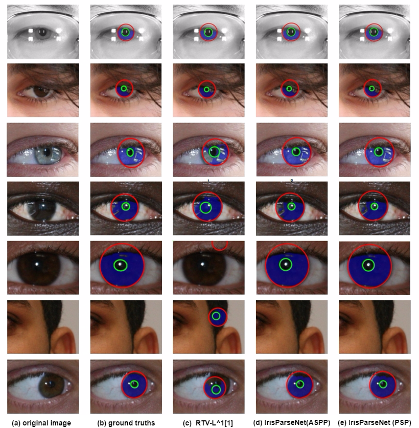

# IrisParseNet
## Joint Iris Segmentation and Localization Using Deep Multi-task Learning Framework

Created by [Caiyong Wang](http://wangcaiyong.com/) at Institute of Automation Chinese Academy of Sciences (**CASIA**)



As shown in the figure above, we present a novel deep learning based joint iris segmentation and localization method, named as **IrisParseNet**. Unlike the former many FCN based iris segmentation methods, this method not only realizes accurate iris sgementation, but also solves the most import problem in the iris preprocessing step, namely iris localization. Besides, this method achieves state-of-the-art performances on various benchmarks. To promote the research on iris preprocessing (especially iris segmentation and iris localization), we have made our ground-truth annotations, annotation codes and evaluation protocols freely available to the community. 

## Citation
If you use this code or ground-truth annotations for your research, please cite our papers.

```
@article{casiairis2019,
  title={Joint Iris Segmentation and Localization Using Deep Multi-task Learning Framework},
  author={Caiyong Wang and Yuhao Zhu and Yunfan Liu and Ran He and Zhenan Sun},
  journal={arXiv preprint abs/1901.11195},
  year={2019}
}
```
## Prerequisites
- [Halcon](https://www.mvtec.com/products/halcon/) 10.0/13.0 or above  for **labeling iris inner/outer boundary**
- matlab R2016a (other versions are ok) for **evaluating the performance of the proposed method**

## Getting Started

### Annotation codes
we use the interactive development environment (HDevelop) provided by the machine vision software, i.e. MVTec Halcon. Before labeling, you need to install Halcon software. Halcon is a paid software, but it allows to try out for free, please refer to the page:
https://www.mvtec.com/products/halcon/now/.

Our halcon based annotation codes can be found in **code/annotation**. The code can help us to label
iris inner/outer bounadry and output a variety of kinds of annatation results as much as possible.

### Annotation ground truths  
We do not have control of the links to the original databases except for **CASIA iris database**. Please do a Google or similar search to try to find the database website if the links below do not work.

We provide the following annotation results:

| directory name | README |
| ------ | ------ |
| center | pupil center image|
| center_rough |dilated pupil center image with a circular structuring element of radius 3|
| inner | iris inner boundary image|
| Inner_rough | dilated iris inner boundary image with a circular structuring element of radius 3|
| outer | iris outer boundary image |
| Outer_rough | dilated iris outer boundary image with a circular structuring element of radius 3|
| pupil_edge_mask | filled iris inner boundary image|
| pupil_edge_mask_binary | filled iris inner boundary binary image |
| iris_edge_mask | filled iris outer boundary image |
| iris_edge_mask_binary | filled iris outer boundary binary image|
| circle_params | the parameter of labeled iris inner/outer circular boundary|
| ellipse_params | the parameter of labeled iris inner/outer elliptical boundary |
| edge | iris boundary image where iris inner/outer boundary is labeled as 1/2, respectively  |
| label_center | the x-y coordinate and exist status (1: existing 2: not existing, meanwhile x,y=-1) parameter of pupil center position |
| JPEGImages | original input image|
| SegmentationClass | segmentation ground truth |
| SegmentationClass_1D | binary segmentation ground truth |


Detailed database description are listed as follows:

- **CASIA-Iris-Distance (CASIA)** 

The CASIA database contains 2576 images from 142 subjects with resolution of
2352×1728 pixels captured under near infrared illumination (**NIR**). Here, we use a subset introduced in paper[2] (totalling **300 iris images for training, 100 iris images for testing**), for which iris segmentation and localization groundtruths is available. Besides, all images are resized to **640×480** pixels. 

 **Link to the original database and ground truth**:  [[Google Drive](https://drive.google.com/open?id=1VnkYjHjZejhefhjKSUOmsLLOYZaDC91K)] [[Baidu Drive](https://pan.baidu.com/s/1gAIm3ug1ieM9d3w1Q95e4w)]

- **UBIRIS.v2 (UBIRIS)**

The UBIRIS database contains 11102 images from 261 subjects which are acquired
in visible light illumination (**VIS**). Here, we use a subset introduced in [NICE.I competition](http://nice1.di.ubi.pt/)
(totalling **500 iris images for training, 445 iris images for testing**), for which iris segmentation and localization groundtruths is available. Besides, all images are resized to 
**400×300** pixels. 

 **Link to the original database**: [click here](http://iris.di.ubi.pt/ubiris2.html)

 **Ground truth segmentation files**: [click here](http://nice1.di.ubi.pt/)
 
 **Ground truth localization files**: [[Google Drive](https://drive.google.com/open?id=1Pt8hrSBlRbznlqIye_oHr4JSWk0Qz2CD)] [[Baidu Drive](https://pan.baidu.com/s/1F_-EJ5zrBGC9Xe5H-SQjWg)]


- **MICHE-I (MICHE)** 

The MICHE images were captured by three mobile devices including iPhone5
(abbreviated IP5, 1262 images), Samsung Galaxy S4 (abbreviated GS4, 1297 images), and Samsung Galaxy Tab2 (abbreviated GT2, 632 images) in uncontrolled conditions with visible light illumination (**VIS**). Here, we use a subset introduced in paper[3] (totalling **140 iris images for training, 429 iris images for testing**), for which iris segmentation and localization groundtruths is available. Besides, the width of all iris images is resized to 400 and height is resized to maintain the same proportions as the original image. Finally, the size of resized image is approximately **400x400**. 

 **Link to the original database**: [click here](http://biplab.unisa.it/MICHE/database/MICHE_BIPLAB_DATABASE/)

 **Ground truth segmentation files**: Please contact yh94@kentforlife.net or yh94@kent.ac.uk 
  (the author of paper[3]).
 
 **Ground truth localization files**: [[Google Drive](https://drive.google.com/open?id=16bTDtrpeRbYx9MVn9sojinjn5HeqizNn)] [[Baidu Drive](https://pan.baidu.com/s/1SKwO0pAY3NSMm_cXd92CQw)]

**Note that** because the boundary of some images is very difficult to label, we deleted these images. Hence the dataset finally used in the experiment is summaried as follows:

| dataset | CASIA | UBIRIS  | MICHE |
| ------ | ------ |------ |------ |
| No. of training set |296 | 498 | 140 |
| No. of testing set|99 | 445 | 429  |

In order to access the annotation files, it must be sent an email to Dr. Wang(**wangcaiyong2017@ia.ac.cn**) asking for the password of the zip file.

### Evaluation protocols
The iris segmentation and localization evaluation codes are provided. During realizing the 
evaluation protocols, we've referenced a lot of open source codes. Here, we thank them, especially
[USIT Iris Toolkit v2](http://www.wavelab.at/sources/Rathgeb16a/), [TVM-iris segmentation](https://www4.comp.polyu.edu.hk/~csajaykr/tvmiris.htm), [GlaS Challenge Contest](https://warwick.ac.uk/fac/sci/dcs/research/tia/glascontest/evaluation/).

Please read our paper for detailes. The evaluation codes can be found in **code/evaluation**.

## Reference 
[1] Zhao, Zijing, and Ajay Kumar. "An Accurate Iris Segmentation Framework Under Relaxed Imaging Constraints Using Total Variation Model." international conference on computer vision (2015): 3828-3836.

[2] Liu, Nianfeng, et al. "Accurate iris segmentation in non-cooperative environments using fully convolutional networks." Biometrics (ICB), 2016 International Conference on. IEEE, 2016.

[3] Hu, Yang, Konstantinos Sirlantzis, and Gareth Howells. "Improving colour iris segmentation using a model selection technique." Pattern Recognition Letters 57 (2015): 24-32.

## Questions
Please contact wangcaiyong2017@ia.ac.cn
  
  
 


  
